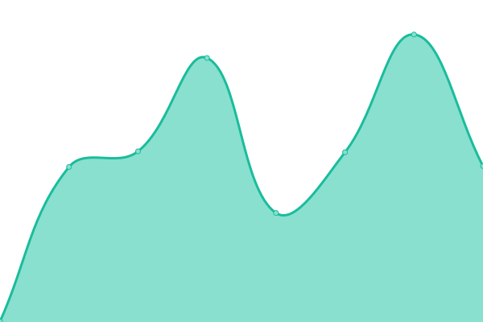

# [📈 Live Status](https://status.olbrew.me): <!--live status--> **🟧 Partial outage**

This repository contains the open-source uptime monitor and status page for [olbrew](https://olbrew.me), powered by [Upptime](https://github.com/upptime/upptime).

With [Upptime](https://upptime.js.org), you can get your own unlimited and free uptime monitor and status page, powered entirely by a GitHub repository. We use [Issues](https://github.com/olbrew/upptime/issues) as incident reports, [Actions](https://github.com/olbrew/upptime/actions) as uptime monitors, and [Pages](https://status.olbrew.me) for the status page.

<!--start: status pages-->
<!-- This summary is generated by Upptime (https://github.com/upptime/upptime) -->
<!-- Do not edit this manually, your changes will be overwritten -->
<!-- prettier-ignore -->
| URL | Status | History | Response Time | Uptime |
| --- | ------ | ------- | ------------- | ------ |
|  [olbrew.me](https://olbrew.me) | 🟩 Up | [olbrew-me.yml](https://github.com/olbrew/upptime/commits/HEAD/history/olbrew-me.yml) | 

 290ms
     
 | 

<a href="https://status.olbrew.me/history/olbrew-me">100.00%</a>
    

|  [drphilbe.com](https://drphilbe.com) | 🟩 Up | [drphilbe-com.yml](https://github.com/olbrew/upptime/commits/HEAD/history/drphilbe-com.yml) | 

 252ms
     
 | 

<a href="https://status.olbrew.me/history/drphilbe-com">100.00%</a>
    

|  [dermatologiediest.be](https://dermatologiediest.be) | 🟩 Up | [dermatologiediest-be.yml](https://github.com/olbrew/upptime/commits/HEAD/history/dermatologiediest-be.yml) | 

 551ms
     
 | 

<a href="https://status.olbrew.me/history/dermatologiediest-be">100.00%</a>
    

|  [www.meeussengalerieoptiek.be](https://www.meeussengalerieoptiek.be) | 🟩 Up | [www-meeussengalerieoptiek-be.yml](https://github.com/olbrew/upptime/commits/HEAD/history/www-meeussengalerieoptiek-be.yml) | 

 608ms
     
 | 

<a href="https://status.olbrew.me/history/www-meeussengalerieoptiek-be">100.00%</a>
    

|  [Test Broken Site](https://thissitedoesnotexist.koj.co) | 🟥 Down | [test-broken-site.yml](https://github.com/olbrew/upptime/commits/HEAD/history/test-broken-site.yml) | 

 0ms
     
 | 

<a href="https://status.olbrew.me/history/test-broken-site">100.00%</a>
    

<!--end: status pages-->

[**Visit our status website →**](https://status.olbrew.me)

## 📄 License

- Powered by: [Upptime](https://github.com/upptime/upptime)
- Code: [MIT](./LICENSE) © [olbrew](https://olbrew.me)
- Data in the `./history` directory: [Open Database License](https://opendatacommons.org/licenses/odbl/1-0/)
